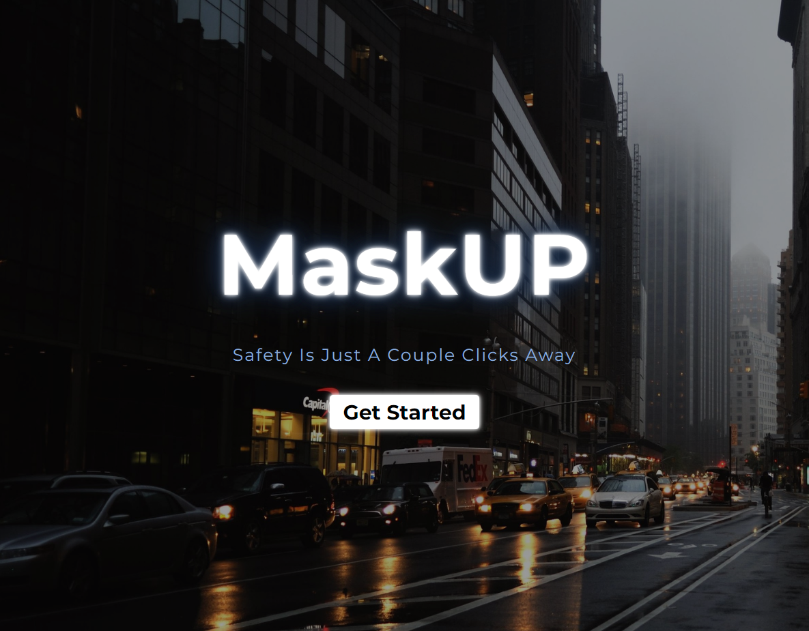
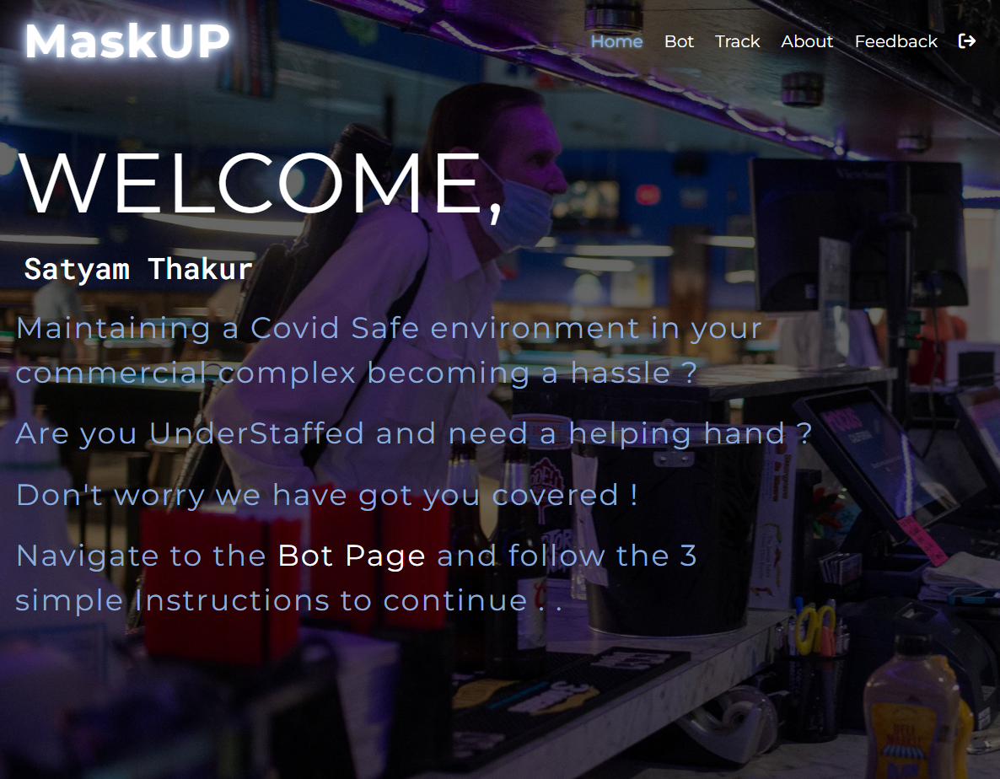
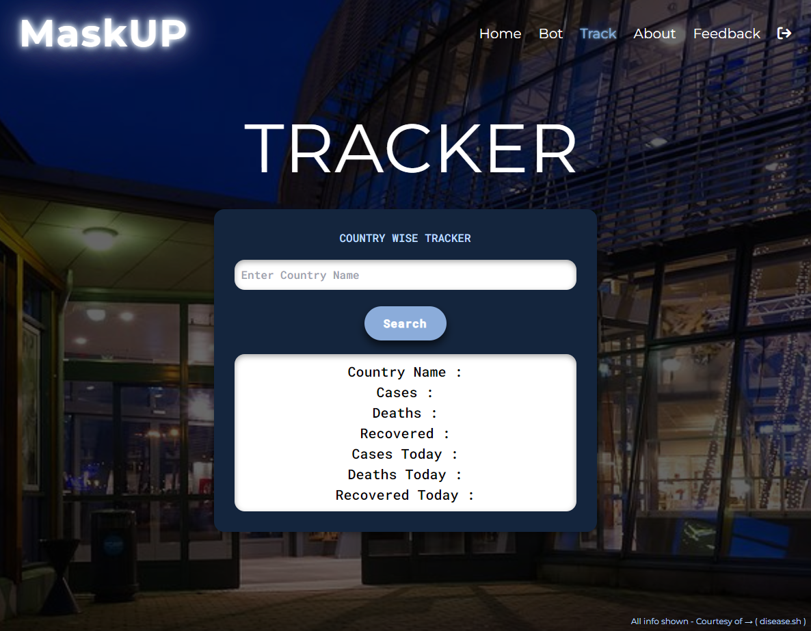

# B.Tech Final Year ( Major ) Project - MaskUP

Designed to help understaffed, small / medium sized businesses in
helping them maintain WHO mandated guideline for Covid outbreak
which is primarily → ( Wearing a Face Mask ). We detect and
prompt people entering your commercial complex to follow the
guidelines using a Machine Learning approach.

### Screenshots :-

- Landing Page
  

- SignIn Page ( Google Authentication - Firebase)
  

- Home Page
  

- Bot Page
  

- Tracker Page ( Using disease.sh/ API )
  

- About Page ( Contains Our Source Code )
  

- Feedback Page ( Email.JS )
  

### Links

- Live Site URL :

### Built with

- ReactJS
- TensorflowJS
